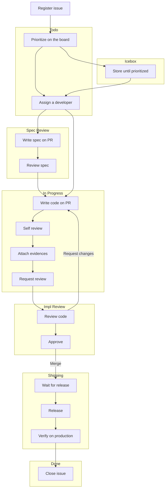

# The OSBR Standard Repository

A template repository for creating standardized repositories over organization.

## Getting Started

1. Use this repository as a template for creating new repositories in osbr-jp organization.
2. Add branch rulesets (not copied from the standard repository).
    * `main` and `release` branch should be protected with the following rules:
        * Require pull request reviews before merging
        * Require status checks to pass before merging
3. Invite collaborators by authorizing teams.
4. Create a new GitHub Projects board by copying 'Standard Project Template'.
    * Configure a workflow option named 'Auto-add to project' to add issues to the project automatically.
5. Edit this README.md file to fit the new repository.

-----

Below is a README that explains the settings configured in the template repository. Leave it as-is or modify if needed.

## Repository Configuration

### Issue Templates

Choose one of the following issue types when creating a new issue.

| No. | Name | Description |
| --- | ---- | ----------- |
| 1 | `Addition` | A format for changes made to introduce new code, features, or functionality that did not exist before. |
| 2 | `Modification` | A change made to existing code to alter its behavior or add new functionality. |
| 3 | `Refactoring` | A change made to existing code to improve its structure, readability, or maintainability without altering its behavior. |
| 4 | `Fix` | A change made to correct an error, bug, or unintended behavior in existing code. |
| 5 | `Epic` | Group and organize related issues under a single high-level overview of a larger goal. |
| 6 | `Idea` | Capture potential features, improvements, or concepts for future consideration. |

### Labels

Use following labels to categorize issues. Note these are not for pull requests.

| No. | Name | Description |
| --- | ---- | ----------- |
| 1 | `🧩 Domain Modeling` | Domain model development. |
| 2 | `🌐 Server Side` | Server side development. |
| 3 | `🖥️ Client Side` | Client side development. |
| 4 | `🚑 DB Data Migration` | Executing sql to modify data manually. |
| 5 | `🛢️ DB Schema Migration` | Adding another DB schema migration file. |
| 6 | `🔄 CI/CD` | Configuring GitHub Actions. |
| 7 | `📝 Documentation` | Adding another markdown file or writing more comments. |
| 8 | `☁️ IaC` | Cloud infra orchestration by code. |
| 9 | `🔧 Ops` | Run one-shot batch program etc. |
| 10 | `🔒 Security` | Fixing vulnerabilities or improving security. |

### GitHub Actions

The following GitHub Actions are pre-configured in this repository.

| No. | Name | Description |
| --- | ---- | ----------- |
| 1 | `start-pull-request` | Create a pull request by assigning a developer to the issue. |
| 2 | `prepare-release` | Prepare a release pull request merging main to release. |
| 3 | `run-tests` | Skelton action which is supposed to run tests. |
| 4 | `release` | Skelton action which is supposed to deploy and publish release note. |

-----

## GitHub Projects

The project board contains following columns to manage the progress of the project.

### Status

| No | Status        | Description                                                               |
|----|---------------|---------------------------------------------------------------------------|
| 1  | Icebox        | Not yet prioritized to be worked on.                 |
| 2  | Todo          | Ready to be worked on specification.                               |
| 3  | Spec Review   | On a specification review before being 'In Progress'. Can skip if enough confident. |
| 4  | In Progress   | Currently being worked on implementation.              |
| 5  | Impl Review   | On a implementation review before being merged. |
| 6  | Shipping      | Merged to 'main', issue closed, and ready to be shipped. |
| 7  | Done          | Shipped and verified on the production environment. |

The following is a flowchart of the project status.

### Priority

Priority is used to determine the order of tasks to be worked on. Relatively set and updated by weekly planning.

| No | Priority      | Description                                                               |
|----|---------------|---------------------------------------------------------------------------|
| 1  | High          | High priority, must be done as soon as possible. |
| 2  | Medium-High   | High priority, but can be done after 'High' priority tasks. |
| 3  | Medium        | Medium priority, prioritized neither high nor low. |
| 4  | Medium-Low    | Low priority, but can be done before 'Low' priority tasks. |
| 5  | Low           | Low priority, can be done after 'Medium-Low' priority tasks. |

### Effort

Person days are used to estimate the number of days needed to complete a task. When this has 1 worker day, it means that it can be done in a day by a single person. Minimum person days are 0.25.

### Difficulty

Difficulty estimates the complexity of a task, which may arise from unclear specifications or insufficient information, as well as requiring advanced knowledge or expertise.

### Sprint

Sprint is a period of time during which specific work has to be completed and made ready for review. It is usually 1 week long.

-----

## Weekly Planning

All developers participate in the weekly planning meeting to discuss the progress of the project and plan the next week's work.

Following is the agenda for the weekly planning meeting.

#### Update the project board

* Make sure all issues have correct `Labels`, `Priority`, `Effort`, and `Difficulty`.
* Check all issues in the previous sprint are closed and "Done" for status.
* Carry over issues that are not completed to the next current sprint.

#### Review the previous sprint's achievements and challenges

* Watch the demo movies of the completed pull requests at the previous sprint.
* Highlight completed tasks and their impact on the project.
* Identify any blockers or unresolved issues and discuss their root causes.
* Share lessons learned to improve future sprints.

#### Share individual progress updates

* Each team member provides a brief update on their tasks, progress, and any obstacles they are facing.
* Encourage questions and collaboration to address blockers or dependencies.

#### Align on priorities for the current sprint

* Confirm the scope of the sprint based on the carried-over issues and new priorities.
* Assign tasks to team members, ensuring alignment with their capacity and expertise.
* Discuss any adjustments to the project timeline if necessary.

#### Plan for the next steps

* Set deadlines for critical issues.
* Identify areas where team members may need additional support, such as training or resources.
* Schedule a follow-up session to review mid-sprint progress.

#### Close the meeting

* Summarize key takeaways and action items.
* Encourage feedback on the meeting's structure or areas for improvement.
* End with a positive note to motivate the team for the upcoming sprint!
