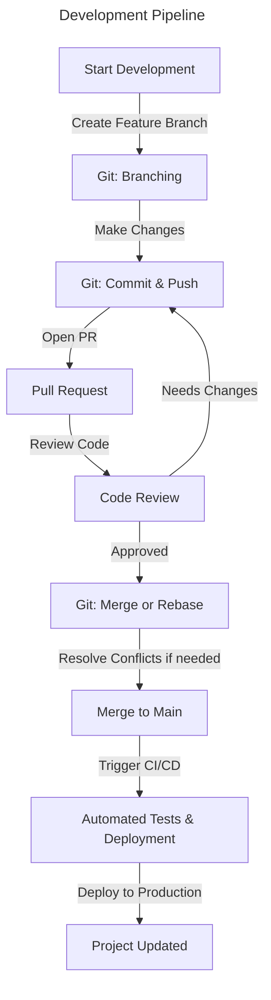

# Developer of Today

:::info Überprogrammer
The Übermensch, a concept from Nietzsche’s philosophy, represents an individual who transcends limitations. Just as the Übermensch rejects complacency, developers challenge outdated methodologies and shape the future of the digital landscape.
:::

[[TOC]]

## 1. The Mindset We Value in the AI Era

Like many early-stage startups, we are facing challenges in attracting top talent. However, with the rise of LLMs, the way we define skill as an effective capability is dynamically shifting. Even those who were once considered top professionals are now being pushed to adapt and transform.

While past achievements certainly deserve recognition, we believe the following factors are especially important at OSBR:

### 1-1. A Passion for Innovation Using AI

An ability to critically evaluate AI-generated artifacts, neither unconditionally accepting nor outright rejecting them, but discerning whether they are accurate or flawed, beneficial or harmful.

In other words, it is a mindset that seeks to go beyond AI artifacts by leveraging AI itself in creating greater value rather than merely replicating it. To pursue true innovation is to demand intellectual curiosity, creativity and perseverance, which AI-generated artifacts alone can never satisfy. Those who thrive in this field are not merely replicators of AI-generated output but active participants in shaping the future of technology.

### 1-2. A Careful Insight into Semantic Integrity

A linguistic skill to enrich contextual vocabularies while avoiding ambiguity, ranging from individual words to broader conceptual frameworks, and from upstream to downstream processes.

We prioritize this skill because we believe that software design is, in essence, the design of a domain-specific language (DSL) that is sufficiently descriptive for building software. In this context, the meaning of "language" expands as follows:

#### Descriptive Languages

| Format          | Name                 | Comment                                                                     |
| --------------- | -------------------- | --------------------------------------------------------------------------- |
| Character-Based | Natural Language     | Descriptive across all levels of abstraction.                               |
| Character-Based | Programming Language | Executable as a formal expression with no ambiguity.                        |
| Graphical       | Graphic Image        | Represents an aspect of an object visually.                                 |
| Graphical       | Movie                | Provides a more immersive representation through time-based transformation. |

These languages capture different aspects of an object from various perspectives. Ultimately, the key concern is not syntax but semantics. With a careful understanding of semantic integrity, we can describe objects with greater confidence. Otherwise, both humans and AI risk losing their way in ambiguity.

### 1-3. Emotional Intelligence Over Raw Intelligence

In a world increasingly shaped by AI, emotional intelligence (EQ) matters more than ever. While technical skills and intellect (IQ) are valuable, the ability to understand, empathize, and connect with others is what truly drives meaningful collaboration and leadership.

Empathy is not just an inherent trait but a skill that can be developed. Being kind, supportive, and strong at the same time is essential in any professional environment. Leadership, in particular, demands emotional resilience, not only in making sound decisions but also in maintaining a positive and composed demeanor. After all, a leader’s attitude sets the tone for the entire team.

### 1-4. A Directive Mindset for Decision-Making

A sense of directive thinking over binary thinking—in other words, a thoughtful mindset that seeks "better or worse" rather than simply concluding "right or wrong."

In the dark, we may walk straight with a light in our hand, illuminating the ground to ensure each step. However, we lose our way when we raise our heads, letting the light sweep from east to west instead of guiding our path. In reality, the best direction is often somewhere between right and left, and the same applies to every software decision.

Decision-making is not about finding the perfect answer but about choosing the best course of action in a given context. A directive mindset enables us to move forward despite uncertainty, refining our approach as we learn from experience.

### 1-5. A Strong Sense of Responsibility

Some argue that the last remaining job for humanity will be to take responsibility for AI’s failures. This may sound dystopian, yet it is a compelling notion as AI agents increasingly demonstrate their ability to take over intellectual tasks.

However, this is not necessarily a pessimistic outlook as long as we can assess and control AI’s outputs. Rather than competing with AI in producing ever-faster and more advanced results, it is more reasonable for humanity to focus on guiding and overseeing its development.

Ultimately, responsibility cannot be shifted onto AI itself. No matter how advanced AI becomes, it lacks true agency or accountability. This makes individual responsibility more important than ever, while ensuring that when problems arise, we have the ability to recognize, address, and resolve them effectively.

### 1-6. Communication, Teamwork and Collaboration

A brilliant idea alone is not enough. Its impact depends on how well it is communicated and implemented through teamwork. Strong communication skills help ensure clarity, reduce misunderstandings, and foster productive collaboration.

Teamwork is an essential part of every successful project. The ability to work harmoniously with colleagues, provide constructive feedback and adapt to different working styles leads to better solutions. At OSBR, we value individuals who actively contribute to a culture of open communication, respect and shared problem-solving.

## 2. Technical Skills

At OSBR, we believe that technicality isn't just about knowing specific tools. It’s about continuously improving, adapting, and applying knowledge effectively. While past experience is valuable, what truly matters is a strong foundation in core technologies and a willingness to learn.

### 2-1. Proficiency and Interest in Core Technologies

A solid understanding of fundamental technologies is crucial for building reliable and scalable systems. While specific tech stacks may change, having a strong grasp of core programming concepts, data structures, and algorithms allows engineers to adapt to new tools and frameworks quickly.

| Field                | Key Areas of Focus                                        |
| -------------------- | --------------------------------------------------------- |
| Backend Development  | API design, database management, server architecture      |
| Frontend Development | UI frameworks, state management, responsive design        |
| AI & Data Processing | Machine learning basics, data pipelines, model deployment |

Beyond just technical skills, there is value in curiosity. There must be a drive to explore new languages, tools, and methodologies.

### 2-2. Polyglot Programmer

The best engineers don’t limit themselves to just one programming language. Instead, they choose the right tool for the job.

Polygot Programmers are those who:

- Are familiar with multiple languages (Python, JavaScript, Go, Rust, C++, etc.)
- Understand language paradigms (object-oriented, functional)
- Understand the need to pick up new languages

We’re not saying that someone who knows every language is superior. Instead, the ability to learn and apply different programming concepts flexibly is a much needed skill in today's developing landscape.

### 2-3. Familiar with Cloud and AI Computing

As AI and cloud computing become integral to modern software development, familiarity with these areas is a huge advantage.
Even if you’re not an AI expert, understanding how cloud-based AI systems work is increasingly essential in today’s tech landscape.

### 2-4. Version Control and Collaboration Tools

Collaboration is at the heart of software development, and version control is a key part of that.

Version control isn’t just about managing code, rather it’s about working efficiently in a team.

### 2-5. Code Quality and Best Practices

Writing code that works is just the beginning—writing code that is clean, maintainable, and scalable is what truly matters.

Good engineers follow best practices, including:

| Best Practice           | Description                                                             |
| ----------------------- | ----------------------------------------------------------------------- |
| Clean Code Principles   | Writing readable, simple, and well-structured code for maintainability. |
| Testing & Debugging     | Implementing unit tests, integration tests, and debugging strategies.   |
| Security Best Practices | Avoiding vulnerabilities and handling sensitive data responsibly.       |
| Optimized Performance   | Writing efficient algorithms and minimizing bottlenecks.                |

Ultimately, the goal is not just to build software, but to build software that lasts.
