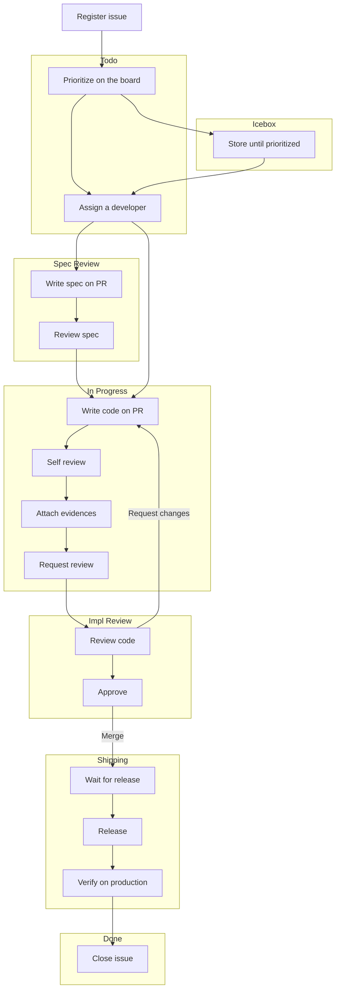

# Development Guide

In this page, you will find the standard development policy and workflow in OSBR.

[[TOC]]

## 1. Setup Your Environment

### Setup Your Machine

Following checklist is all mandatory by our security policy:

* Use company-provided laptop or company-approved personal device.
* Sleep mode activation within 5 minutes, mandatory reauthentication after sleep mode.
* Install antivirus software on Windows devices.
* Prohibit keeping files permanently on the desktop.
* Prohibit displaying text in the browser’s bookmark bar.
* Configure proxy settings for verification and production environment testing.
  * Ask administrator for the proxy settings.

::: warning Notice
Development on self-built development servers is prohibited.
:::

### Email Notification Settings from GitHub

Configure your email notification settings to receive notifications from GitHub. Ensure that you are notified when other developers mention you.

### Setting Up the Container Runtime Environment

Make sure you can execute the `docker` and `docker compose` commands on your terminal. Containers will be used for development tasks such as compiling, running applications, package management, and executing tests.

::: info NOTE
While Docker Desktop is the standard reference, you can also use other tools like Rancher Desktop.
:::

### Editor Configuration

Set up your editor to enable features like auto-completion, navigation, and error checking for the languages used in the project (TypeScript, Go). Also, configure it to automatically format code upon file save. Use Prettier for TypeScript and `go fmt` for Go.

### Setting Up Language Runtime Environments

While container-based development environments are the default, also set up the runtime environment for the languages on your local machine. For Node.js, use tools like `nodebrew` that allow easy version switching.

::: info NOTE
Some tools, such as AWS CDK, might require credentials to be passed via environment variables or files when run inside containers. Due to security considerations, a non-container-based approach might be preferred in such cases.
:::

### Enabling Screenshots and Screen Recording

Throughout the development process, you may need to record operations as images or videos. Set up your system to be ready for this when needed.

For Mac, it is recommended to use **Skitch** for screenshots and **QuickTime Player** (`shift + command + 5`) for video recording.

### Setting Up Application Execution Environments

Follow the instructions provided for each project to set up the required execution environment.

## 2. Workflow Overview

### Scrum-Like Agile Development

::: info NOTE
We learn from Scrum concepts but do not apply them in their entirety. We adapt them to our needs and constraints.

Reference: [Scrum Guide (2020) End Note](https://scrumguides.org/scrum-guide.html#end-note)

> While implementing only parts of Scrum is possible, the result is not Scrum. Scrum exists only in its entirety and functions well as a container for other techniques, methodologies, and practices.
:::

Following practices characterize our agile style:

####  1-Week Sprint

* Work is broken down into short iterations, typically 1 week.
* To ensure continuous delivery of value and frequent opportunities for feedback.
* CI/CD piplines have to be set up and automated first.

#### Brief Issues, Contextual Pull Requests

* **Issues** should be short-descripted to help the team:
  * Create small, manageable tasks that fit within a 1-week sprint.
  * Encourage the creation of more issues to track all identifiable tasks at any given moment.
  * Motivate project leaders to take ownership of issue creation instead of delegating it to team members.
  * Clarify whether details should be documented in an issue or a pull request, avoiding confusion.
* **Pull Requests** should include detailed context to:
  * Ensure reviewers have all the necessary information without requiring additional clarification from the author.
  * Integrate seamlessly with tools like GitHub Copilot code review.
  * Serve as lightweight [ADR](https://adr.github.io/)s by preserving context and making it easier to refer back to decisions in the future.
 
#### Weekly Planning 

* **Retrospective Session**:
  * We hold a retrospective to share what went well, what could be improved, and challenges or blockers that hindered progress.
* **Set Iteration Goals**:
  * The team collaboratively defines clear, achievable goals for the sprint, ensuring alignment with overall issues on the project board.
  * Tasks are selected and assigned to team members based on their capacity and expertise, prioritizing high-impact work that fits within the sprint timeline.

#### Visual Evidence Policy

* Screenshots and videos must be used to illustrate both issues and pull requests. For pull requests, it is mandatory to provide these as evidence.
* This policy is not intended to question developers' integrity but to protect them from potential conflicts within the project.
* During retrospective sessions, these visual artifacts are reviewed as part of the sprint demo. 

### GitHub Configuration

Our activities are primarily centered around GitHub rather than other tools. This means our GitHub configuration provides an overview of our development workflow.

Following configurations are applied to each repository from the standard template repository.

#### Issue Templates

Choose one of the following issue types when creating a new issue.

| No. | Name | Description |
| --- | ---- | ----------- |
| 1 | `Addition` | A format for changes made to introduce new code, features, or functionality that did not exist before. |
| 2 | `Modification` | A change made to existing code to alter its behavior or add new functionality. |
| 3 | `Refactoring` | A change made to existing code to improve its structure, readability, or maintainability without altering its behavior. |
| 4 | `Fix` | A change made to correct an error, bug, or unintended behavior in existing code. |
| 5 | `Epic` | Group and organize related issues under a single high-level overview of a larger goal. |
| 6 | `Idea` | Capture potential features, improvements, or concepts for future consideration. |

#### Labels

Use following labels to categorize issues. Note these are not for pull requests.

| No. | Name | Description |
| --- | ---- | ----------- |
| 1 | `🧩 Domain Modeling` | Domain model development. |
| 2 | `🌐 Server Side` | Server side development. |
| 3 | `🖥️ Client Side` | Client side development. |
| 4 | `🚑 DB Data Migration` | Executing sql to modify data manually. |
| 5 | `🛢️ DB Schema Migration` | Adding another DB schema migration file. |
| 6 | `🔄 CI/CD` | Configuring GitHub Actions. |
| 7 | `📝 Documentation` | Adding another markdown file or writing more comments. |
| 8 | `☁️ IaC` | Cloud infra orchestration by code. |
| 9 | `🔧 Ops` | Run one-shot batch program etc. |
| 10 | `🔒 Security` | Fixing vulnerabilities or improving security. |

#### GitHub Actions

The following GitHub Actions are pre-configured in each repository.

| No. | Name | Description |
| --- | ---- | ----------- |
| 1 | `start-pull-request` | Create a pull request by assigning a developer to the issue. |
| 2 | `prepare-release` | Prepare a release pull request merging main to release. |
| 3 | `run-tests` | Skelton action which is supposed to run tests. |
| 4 | `release` | Skelton action which is supposed to deploy and publish release note. |

#### Status

This field belongs our standard project board.

| No | Status        | Description                                                               |
|----|---------------|---------------------------------------------------------------------------|
| 1  | Icebox        | Not yet prioritized to be worked on.                 |
| 2  | Todo          | Ready to be worked on specification.                               |
| 3  | Spec Review   | On a specification review before being 'In Progress'. Can skip if enough confident. |
| 4  | In Progress   | Currently being worked on implementation.              |
| 5  | Impl Review   | On a implementation review before being merged. |
| 6  | Shipping      | Merged to 'main', issue closed, and ready to be shipped. |
| 7  | Done          | Shipped and verified on the production environment. |

The following is a flowchart of the project status.

##### Flowchart of Status

#### Priority

Priority is used to determine the order of tasks to be worked on. Relatively set and updated by weekly planning.

| No | Priority      | Description                                                               |
|----|---------------|---------------------------------------------------------------------------|
| 1  | High          | High priority, must be done as soon as possible. |
| 2  | Medium-High   | High priority, but can be done after 'High' priority tasks. |
| 3  | Medium        | Medium priority, prioritized neither high nor low. |
| 4  | Medium-Low    | Low priority, but can be done before 'Low' priority tasks. |
| 5  | Low           | Low priority, can be done after 'Medium-Low' priority tasks. |

#### Effort

Person days are used to estimate the number of days needed to complete a task. When this has 1 worker day, it means that it can be done in a day by a single person. Minimum person days are 0.25.

#### Difficulty

Difficulty estimates the complexity of a task, which may arise from unclear specifications or insufficient information, as well as requiring advanced knowledge or expertise.

#### Sprint

Sprint is a period of time during which specific work has to be completed and made ready for review. It is usually 1 week long.

### Weekly Planning

All developers participate in the weekly planning meeting to discuss the progress of the project and plan the next week's work.

Following is the typical agenda for the weekly planning meeting.

#### Update the project board

* Make sure all issues have correct `Labels`, `Priority`, `Effort`, and `Difficulty`.
* Check all issues in the previous sprint are closed and "Done" for status.
* Carry over issues that are not completed to the next current sprint.

#### Review the previous sprint's achievements and challenges

* Watch the demo movies of the completed pull requests at the previous sprint.
* Highlight completed tasks and their impact on the project.
* Identify any blockers or unresolved issues and discuss their root causes.
* Share lessons learned to improve future sprints.

#### Share individual progress updates

* Each team member provides a brief update on their tasks, progress, and any obstacles they are facing.
* Encourage questions and collaboration to address blockers or dependencies.

#### Align on priorities for the current sprint

* Confirm the scope of the sprint based on the carried-over issues and new priorities.
* Assign tasks to team members, ensuring alignment with their capacity and expertise.
* Discuss any adjustments to the project timeline if necessary.

#### Plan for the next steps

* Set deadlines for critical issues.
* Identify areas where team members may need additional support, such as training or resources.
* Schedule a follow-up session to review mid-sprint progress.

#### Close the meeting

* Summarize key takeaways and action items.
* Encourage feedback on the meeting's structure or areas for improvement.
* End with a positive note to motivate the team for the upcoming sprint!
