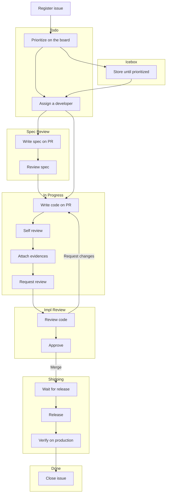

# Development Guide

In this page, you will find the standard development policy and workflow in OSBR.

[[TOC]]

## 1. Setup Your Environment

### 1-1. Setup Your Machine

The following checklist is all mandatory by our security policy:

* Use company-provided laptop or company-approved personal device.
* Sleep mode activation within 5 minutes, mandatory reauthentication after sleep mode.
* Install antivirus software on Windows devices.
* Prohibit keeping files permanently on the desktop.
* Prohibit displaying project or client names in the browser’s bookmark bar.
* Configure proxy settings for verification and production environment testing.
  * Ask administrator for the proxy settings.

::: warning Notice
Development on self-built development servers is prohibited.
:::


### 1-2. Email Notification Settings from GitHub

Configure your email notification settings to receive notifications from GitHub. Ensure that you are notified when other developers mention you.

### 1-3. Setting Up the Container Runtime Environment

Make sure you can execute the `docker` and `docker compose` commands on your terminal. Containers will be used for development tasks such as compiling, running applications, package management, and executing tests.

::: info NOTE
While Docker Desktop is the standard reference, you can also use other tools like Rancher Desktop.
:::

### 1-4. Editor Configuration

Set up your editor to enable features like auto-completion, navigation, and error checking for the languages used in the project (TypeScript, Go). Also, configure it to automatically format code upon file save. Use Prettier for TypeScript and `go fmt` for Go.
### 1-5. Setting Up Language Runtime Environments

While container-based development environments are the default, also set up the runtime environment for the languages on your local machine. For Node.js, use tools like `nodebrew` that allow easy version switching.

::: info NOTE
Some tools, such as AWS CDK, might require credentials to be passed via environment variables or files when run inside containers. Due to security considerations, a non-container-based approach might be preferred in such cases.
:::

### 1-6. Enabling Screenshots and Screen Recording

Throughout the development process, you may need to record operations as images or videos. Set up your system to be ready for this when needed.

For Mac, it is recommended to use **Skitch** for screenshots and **QuickTime Player** (`shift + command + 5`) for video recording.

### 1-7. Setting Up Application Execution Environments

Follow the instructions provided for each project to set up the required execution environment.


### 1-8. Coding Style Guide

Follow the [Style Guide](/style-guide) for how we write code: language-agnostic
principles plus per-language rules (TypeScript, Go, Python, HTML & CSS,
Terraform), each tagged 🌎 industry-standard or 🏠 house-rule. Read it before your
first pull request.

### 1-9. Design Guidelines

Follow the [Design Guidelines](/design-guidelines) for how the experience
behaves: accessibility as the floor, screens that explain themselves, every
state designed, and modeless, reachable interaction. They are the counterpart to
the Style Guide — that governs how we write code; these govern how the thing we
build feels to use.

### 1-10. Database Guidelines

Follow the [Database Guidelines](/database-guidelines) when choosing a data store
(SQL vs NoSQL) or designing a relational schema, including OSBR's SQL house
style. The [Infrastructure Planning Policy](/infra-planning-policy) sets the
higher-level infrastructure defaults these build on.

### 1-11. The Quality Gate

Follow the [Quality Gate](/quality-gate): the three checks every change clears before it merges — that it is **reliable**, **secure**, and **sustainable**. One engineer, with their AI, holds all three as they build, and the gate holds at `Impl Review` on the board.

### 1-12. AI Usage Guideline

Follow the [AI Usage Guideline](/ai-usage-guideline) for how we work with AI: one engineer owning the whole of a piece of work with AI beside them, and the standards — data boundaries, provider resilience, day/night rhythm, policies-as-plugins — that keep AI-assisted work safe, resilient, and honest.

## 2. Workflow Overview

### 2-1. Scrum-Like Agile Development

::: info NOTE
We learn from Scrum concepts but do not apply them in their entirety. We adapt them to our needs and constraints.

Reference: [Scrum Guide (2020) End Note](https://scrumguides.org/scrum-guide.html#end-note)

> While implementing only parts of Scrum is possible, the result is not Scrum. Scrum exists only in its entirety and functions well as a container for other techniques, methodologies, and practices.
:::

Following practices characterize our agile style:

#### 1-Week Sprint

* Work is broken down into short iterations, typically 1 week.
* To ensure continuous delivery of value and frequent opportunities for feedback.
* CI/CD pipelines have to be set up and automated first.

#### Brief Issues, Contextual Pull Requests

* **Issues** should be briefly described to help the team:
  * Create small, manageable tasks that fit within a 1-week sprint.
  * Encourage the creation of more issues to track all identifiable tasks at any given moment.
  * Motivate project leaders to take ownership of issue creation instead of delegating it to team members.
  * Clarify whether details should be documented in an issue or a pull request, avoiding confusion.
* **Pull Requests** should include detailed context to:
  * Ensure reviewers have all the necessary information without requiring additional clarification from the author.
  * Integrate seamlessly with tools like GitHub Copilot code review.
  * Serve as lightweight [ADR](https://adr.github.io/)s by preserving context and making it easier to refer back to decisions in the future.
 
#### Weekly Planning 

* **Retrospective Session**:
  * We hold a retrospective to share what went well, what could be improved, and challenges or blockers that hindered progress.
* **Set Iteration Goals**:
  * The team collaboratively defines clear, achievable goals for the sprint, ensuring alignment with overall issues on the project board.
  * Tasks are selected and assigned to team members based on their capacity and expertise, prioritizing high-impact work that fits within the sprint timeline.

#### Visual Evidence Policy

* Screenshots and videos must be used to illustrate both issues and pull requests. For pull requests, it is mandatory to provide these as evidence.
* This policy is not intended to question developers' integrity but to protect them from potential conflicts within the project.
* During retrospective sessions, these visual artifacts are reviewed as part of the sprint demo. 

### 2-2. GitHub Configuration

Our activities are primarily centered around GitHub rather than other tools. This means our GitHub configuration provides an overview of our development workflow.

Following configurations are applied to each repository from the standard template repository.

#### Issue Templates

Choose one of the following issue types when creating a new issue.

| No. | Name | Description |
| --- | ---- | ----------- |
| 1 | `Addition` | A format for changes made to introduce new code, features, or functionality that did not exist before. |
| 2 | `Modification` | A change made to existing code to alter its behavior or add new functionality. |
| 3 | `Refactoring` | A change made to existing code to improve its structure, readability, or maintainability without altering its behavior. |
| 4 | `Fix` | A change made to correct an error, bug, or unintended behavior in existing code. |
| 5 | `Epic` | Group and organize related issues under a single high-level overview of a larger goal. |
| 6 | `Idea` | Capture potential features, improvements, or concepts for future consideration. |

#### Labels

Use following labels to categorize issues. Note these are not for pull requests.

| No. | Name | Description |
| --- | ---- | ----------- |
| 1 | `🧩 Domain Modeling` | Domain model development. |
| 2 | `🌐 Server Side` | Server side development. |
| 3 | `🖥️ Client Side` | Client side development. |
| 4 | `🚑 DB Data Migration` | Executing sql to modify data manually. |
| 5 | `🛢️ DB Schema Migration` | Adding another DB schema migration file. |
| 6 | `🔄 CI/CD` | Configuring GitHub Actions. |
| 7 | `📝 Documentation` | Adding another markdown file or writing more comments. |
| 8 | `☁️ IaC` | Cloud infra orchestration by code. |
| 9 | `🔧 Ops` | Run one-shot batch program etc. |
| 10 | `🔒 Security` | Fixing vulnerabilities or improving security. |

#### GitHub Actions

The following GitHub Actions are pre-configured in each repository.

| No. | Name | Description |
| --- | ---- | ----------- |
| 1 | `start-pull-request` | Create a pull request by assigning a developer to the issue. |
| 2 | `prepare-release` | Prepare a release pull request merging main to release. |
| 3 | `run-tests` | Skeleton action which is supposed to run tests. |
| 4 | `release` | Skeleton action which is supposed to deploy and publish release note. |

#### Status

This field belongs to our standard project board.

| No | Status        | Description                                                               |
|----|---------------|---------------------------------------------------------------------------|
| 1  | Icebox        | Not yet prioritized to be worked on.                 |
| 2  | Todo          | Ready to be worked on specification.                               |
| 3  | Spec Review   | On a specification review before being 'In Progress'. Can skip if enough confident. |
| 4  | In Progress   | Currently being worked on implementation.              |
| 5  | Impl Review   | On implementation review before being merged: by declaring this status the engineer takes on running the AI review from their own agent, then a human interprets its findings and owns the merge (see [Code Review](/code-review)). |
| 6  | Shipping      | Merged to 'main' and ready to be shipped. |
| 7  | Done          | Shipped and verified on the production environment; the issue is closed. |

The following is a flowchart of the project status.

##### Flowchart of Status


```mermaid
flowchart TD
    START[Register issue] --> A1[Prioritize on the board]

    subgraph Todo
      A1 --> A2[Assign a developer]
    end

    subgraph Icebox
      A1 --> B1[Store until prioritized]
      B1 --> A2
    end

    subgraph Spec Review
      A2 --> C1[Write spec on PR]
      C1 --> C2[Review spec]
    end

    subgraph In Progress
      C2 --> D1[Write code on PR]
      A2 --> D1
      D1 --> D2[Self review]
      D2 --> D3[Attach evidences]
      D3 --> D4[Request review]
    end

    subgraph Impl Review
      D4 --> E1[Review code]
      E1 --Request changes--> D1
      E1 --> E3[Approve]
    end

    subgraph Shipping
      E3 --Merge--> F1[Wait for release]
      F1 --> F2[Release]
      F2 --> F3[Verify on production]
    end

    subgraph Done
      F3 --> END[Close issue]
    end
```

#### Priority

Priority is used to determine the order of tasks to be worked on. Relatively set and updated by weekly planning.

| No | Priority      | Description                                                               |
|----|---------------|---------------------------------------------------------------------------|
| 1  | High          | High priority, must be done as soon as possible. |
| 2  | Medium-High   | High priority, but can be done after 'High' priority tasks. |
| 3  | Medium        | Medium priority, prioritized neither high nor low. |
| 4  | Medium-Low    | Low priority, but can be done before 'Low' priority tasks. |
| 5  | Low           | Low priority, can be done after 'Medium-Low' priority tasks. |

#### Effort

Person days are used to estimate the number of days needed to complete a task. When this has 1 worker day, it means that it can be done in a day by a single person. Minimum person days are 0.25.

#### Difficulty

Difficulty estimates the complexity of a task, which may arise from unclear specifications or insufficient information, as well as requiring advanced knowledge or expertise.

#### Sprint

Sprint is a period of time during which specific work has to be completed and made ready for review. It is usually 1 week long.


#### Repositories Are Not a Support Channel

The issue tracker is the **engineering backlog** — reproducible defects, planned features, and technical debt the team owns and burns down on engineering time. It is not a helpdesk. Support requests — how-to questions, account problems, billing, "is this broken for me?" — run on a different clock and a different audience, and mixing the two buries real defects under noise while answering users on a cadence never designed for them.

So before any product goes live it has a **dedicated, published support channel**, and the resolution path for a support request stays entirely inside it. When a request lands as an issue anyway, we **thank** the person, **redirect** them to the support channel with its URL, and **close** the issue — never keep it open under a standing `support` label. The only bridge from support into the tracker runs one way: when a support conversation surfaces a genuine defect, its owner opens a fresh, reproduced, engineer-written issue, and the user stays updated in the support channel.

- We **MUST** give every product a nominated, published support channel before it goes live, and resolve support requests there, never through the issue tracker.
- We **MUST** handle a support request that arrives as an issue by thank → redirect → close, rather than parking it under a support label.
- We **SHOULD** re-file genuine engineering work found via support as a fresh, deduplicated, engineer-written issue — not a forwarded user thread.

### 2-3. Weekly Planning

All developers participate in the weekly planning meeting to discuss the progress of the project and plan the next week's work.

Following is the typical agenda for the weekly planning meeting.

#### Update the project board

* Make sure all issues have correct `Labels`, `Priority`, `Effort`, and `Difficulty`.
* Check all issues in the previous sprint are closed and "Done" for status.
* Carry over issues that are not completed to the next current sprint.

#### Review the previous sprint's achievements and challenges

* Watch the demo movies of the completed pull requests at the previous sprint.
* Highlight completed tasks and their impact on the project.
* Identify any blockers or unresolved issues and discuss their root causes.
* Share lessons learned to improve future sprints.

#### Share individual progress updates

* Each team member provides a brief update on their tasks, progress, and any obstacles they are facing.
* Encourage questions and collaboration to address blockers or dependencies.

#### Align on priorities for the current sprint

* Confirm the scope of the sprint based on the carried-over issues and new priorities.
* Assign tasks to team members, ensuring alignment with their capacity and expertise.
* Discuss any adjustments to the project timeline if necessary.

#### Plan for the next steps

* Set deadlines for critical issues.
* Identify areas where team members may need additional support, such as training or resources.
* Schedule a follow-up session to review mid-sprint progress.

#### Close the meeting

* Summarize key takeaways and action items.
* Encourage feedback on the meeting's structure or areas for improvement.
* End with a positive note to motivate the team for the upcoming sprint!

### 2-4. Planning & Shaping

Before a piece of work reaches the board as something we can build, it has to be shaped — turned from a customer's initiative into a committed, understood slice with a number against it and the riskiest part already tested. This is the pre-work phase, and it maps to the early board stages: `Todo`, where a request lands, and `Spec Review`, where we agree it is worth doing and know enough to do it. A week-long sprint gives us little room to discover halfway through that we were solving the wrong problem, so we spend the front of the effort making sure we are not.

**We research the real need before we take a request at face value.** A stated request is a symptom and a hypothesis — evidence of a deeper business need, not the need itself. So we study the customer's world first: how their industry makes money, what people actually do all day versus the tidy process on the org chart, and the workarounds and shadow spreadsheets they have built to survive the current one. We trace each stated request down to the job beneath it — the progress the customer is trying to make, independent of any solution — and we validate that job against what we found. Serving the customer well sometimes means telling them, early and with evidence, that the thing they asked for is not the thing their business needs. That honesty is service, not cleverness at their expense.

**We prove the risky part with something that actually runs.** Where an idea carries real uncertainty — whether it will pay off, whether it is what the customer needs, whether people will use it, whether we can even build it — we do not find out by building the whole thing and hoping. We find out cheaply first, with the smallest experiment that answers the question: a spike for a technical unknown, a thin walking skeleton for an end-to-end one, a proof-of-concept for a doubt about value. The experiment is time-boxed and carries a written question and a written "what result changes our plan." Its value is the lesson, not the code — a spike that fails in three days has saved a three-month bet, and that is a success. Experiment code lives in a clearly marked disposable space (a `lab/` or `spike/` area, a `spike:` comment) and is never quietly promoted into production; if the idea is proven, we budget the real build.

**We size it honestly, and we judge it by the customer's return.** An estimate is a communication that serves a decision, not a promise squeezed out of us, so every estimate carries a visible breakdown, states plainly what it includes and excludes, and is expressed as a range rather than a single figure that hides how little we yet know. Because agents change task cost sharply but unevenly, an estimate says which world it assumes — scaffolded ground with clear specs and tests, or unprepared ground where that speed-up largely evaporates. Above the cost sits the prior question: for this customer's business, does the return justify the spend, and how sure are we? We rank proposals by their return to the customer, not by how large an order they would be for us; we state the expected effect and how certain we are of it; and we phase large spend into increments the customer can verify before funding the next, attacking the riskiest, highest-value part first. The agreed estimate and the accepted case — range, breakdown, assumptions, increment plan — land in the meeting record, so that when an assumption breaks, re-quoting is fair rather than a fight over memory.

**We win and start work by demonstrated capability, not by reciting the past.** When a customer needs to believe we can do the work, we reach for the real thing at hand — a working proof-of-concept against their actual problem, the concrete reasoning behind a design decision, the running service they can click and try to break — before we reach for a list of past projects. A track record answers "were they any good before?"; a demonstration answers "are they solving *this* problem, right now?", and only the second keeps our motivation honestly tied to the customer's value. When we publish case studies to build reputation, we get consent first and keep the detail coarse — the shape of a solution, never the versions, endpoints, and topology an attacker probing the customer's systems would need.

**We share one language across customer, code, and team.** The terms we harvest from the customer's world become the project's ubiquitous language — one authoritative word per concept, agreed with the domain experts and mirrored everywhere the concept appears. We search the existing terms before coining a new one, treat a second synonym for an existing idea as a defect rather than a style choice, and flag contradictions (two words for one thing, one word for two) as findings that usually mark a real boundary. When a concept is renamed, the rename is atomic — code, schema, tests, logs, and docs in the same change — so the old word leaves no landmine for the next reader, human or AI.

- We **MUST** research the customer's industry, real workflow, and pain before treating a request as a specification, and trace every request down to the job it is trying to satisfy.
- We **MUST**, where real uncertainty exists, reduce it with the smallest time-boxed experiment that answers a written question — and keep that experiment disposable and out of production until the real build is budgeted.
- We **MUST** give every estimate a visible breakdown, explicit scope in/out, a range not a single figure, and a stated assumption about scaffolded versus unprepared ground.
- We **MUST** rank proposals by return to the customer rather than order size to us, state the expected effect and its certainty, and phase large spend into increments the customer can verify before funding the next.
- We **MUST** record the agreed estimate and accepted case, with their assumptions, in the meeting record.
- We **SHOULD** demonstrate capability with a runnable proof-of-concept, design reasoning, or the live service before citing past work — and publish case studies only with consent and with detail kept coarse.
- We **SHOULD** capture the field's own terms verbatim as the project's ubiquitous language, one word per concept, and hold that language consistent across the customer, the code, and the team.

Each part of shaping has a full standard behind it: [Market Research](/market-research), [Requirements Modeling](/requirements-modeling), [Verify Before Building](/verify-before-building), [Cost Estimation](/cost-estimation), [IT Investment Evaluation](/it-investment-evaluation), [Legal Compliance](/legal-compliance), [Domain Terminology](/domain-terminology), and [Capability over Track Record](/capability-over-track-record).


## 3. Tutorial

::: info Notice
The `osbrjp/tutorial` is a private repository.
:::

If you are a new developer, start by following the tutorial below on the `osbrjp/tutorial` repository. `osbrjp/tutorial` is a safe repository for learning and getting used to our standard workflow, so feel free to experiment and ask questions.


### 3-1. Create your first issue

#### Choose issue template

Select the issue template from Addition, Modification, Refactoring, or Fix.


#### Fill out the form

Complete all the required fields in the issue form, ensuring the details are clear and concise.


#### Fill extra fields

Provide any additional information required to align the issue with the project board. Take ownership of the issue by assigning it to yourself.


-------

### 3-2. Working on the pull request

#### Fill "Specification / Test Plan" on the pull request

Describe the purpose of your changes and how they will be tested in the "Specification / Test Plan" section of the pull request.


#### Ask someone to review your specification

Set the issue status to `Spec Review`. Mention the reviewer on the pull request. The reviewer will provide a comment to proceed to the next step.


#### Clone the repository

Set the issue status to `In Progress`. Clone the repository to your local machine and check out the branch automatically created alongside the pull request. The branch name follows the format i[issue_no]-[DATE]-[HHMM].

```bash
$ git clone git@github.com:osbrjp/tutorial.git
$ cd tutorial
$ git checkout i1-20250210-1307 # example
```

#### Edit and push

Edit README.md. Just put/remove another black line is enough for this tutorial. Put some commit messages like "Fix README.md" to push the changes.

#### Self review and attach evidences

Return to the pull request and review your changes in the Files changed tab. Provide additional context to explain the purpose of your changes and add any necessary review comments. If everything looks good, submit your review with the "Approve" option to complete the "Self Review" process. After that, record a video on your machine as evidence of the changes and attach it to the pull request description.


Tips: `cmd + shift + 5` for taking video on your computer, finish it up with `cmd + control + esc`.

#### Request review

Set the issue status to `Impl Review`. Check the "Self Review" and "Evidence" checkboxes in the pull request description. Set the "Reviewers" field to the reviewer's name, and add a comment mentioning the reviewer with a nice message, and include a note about the desired review deadline if necessary.

#### Merge the pull request

The reviewer merges the pull request into the main branch at the same time they approve it. Afterward, the issue status changes to `Shipping`.

-------

### 3-3. Release

#### Check the release pull request

The release pull request is created automatically when the pull request is merged into `main`. Check the release branch to ensure the changes are included.


#### Review and merge the release pull request

Approve the release pull request and merge it into the release branch. In a real development process, this operation is carried out by the team.

#### Verify the release

In a real development process, the release is verified by the team on the production environment.

