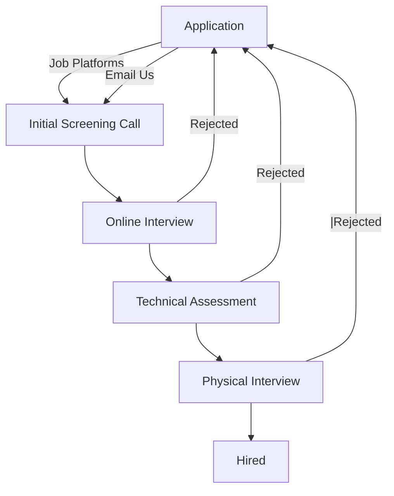

# Hiring Process

Our hiring process ensures that candidates are evaluated fairly based on their skills, experience, and cultural fit. Below is an overview of the steps:



## 1. Apply on Job Searching Platforms

Submit your application by reaching us through [email](mailto:info@osbrjp.com). Alternatively you can look for us on platforms such as Hiredly and JobStreet.

## 2. Initial Screening Call

We will reach out for a short screening call, covering basic questions such as:

- Your current location
- Preferred mode of transport
- Availability and expected salary

## 3. Online Interview

Afterwards, we will set up a virtual interview consisting of personality and technical questions relevant to the position.

## 4. Technical Assessment

Shortlisted candidates will receive a technical assessment, through email, to evaluate their problem-solving skills and expertise. These assessments would be based on work we had done before.

## 5. Physical Interview

Finally, an in-person interview to assess cultural fit with the company and discuss expectations before moving forward with the hiring decision will be conducted.

```

```
