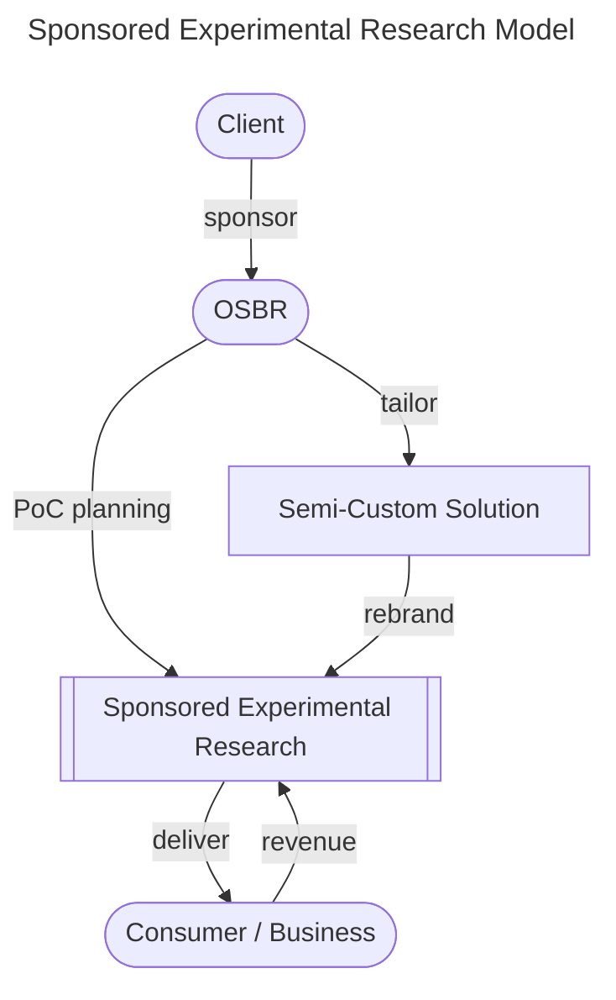
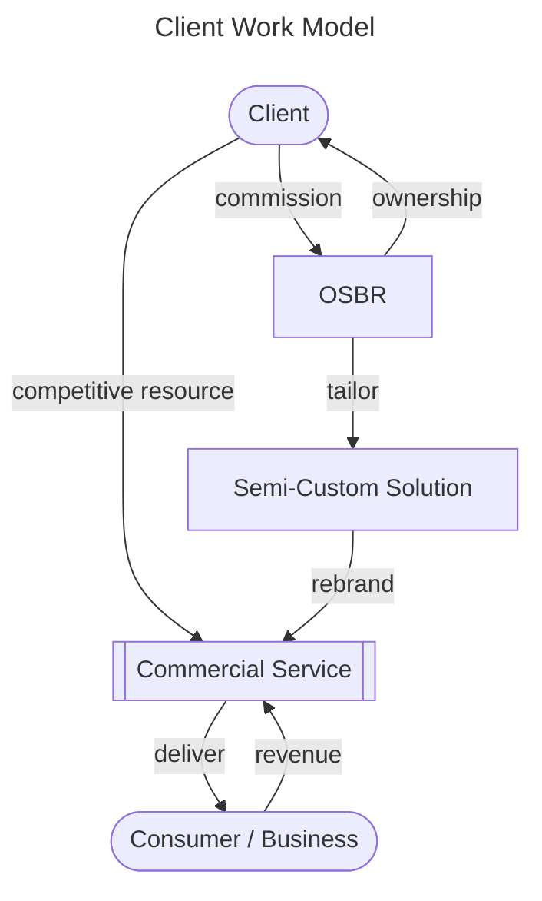
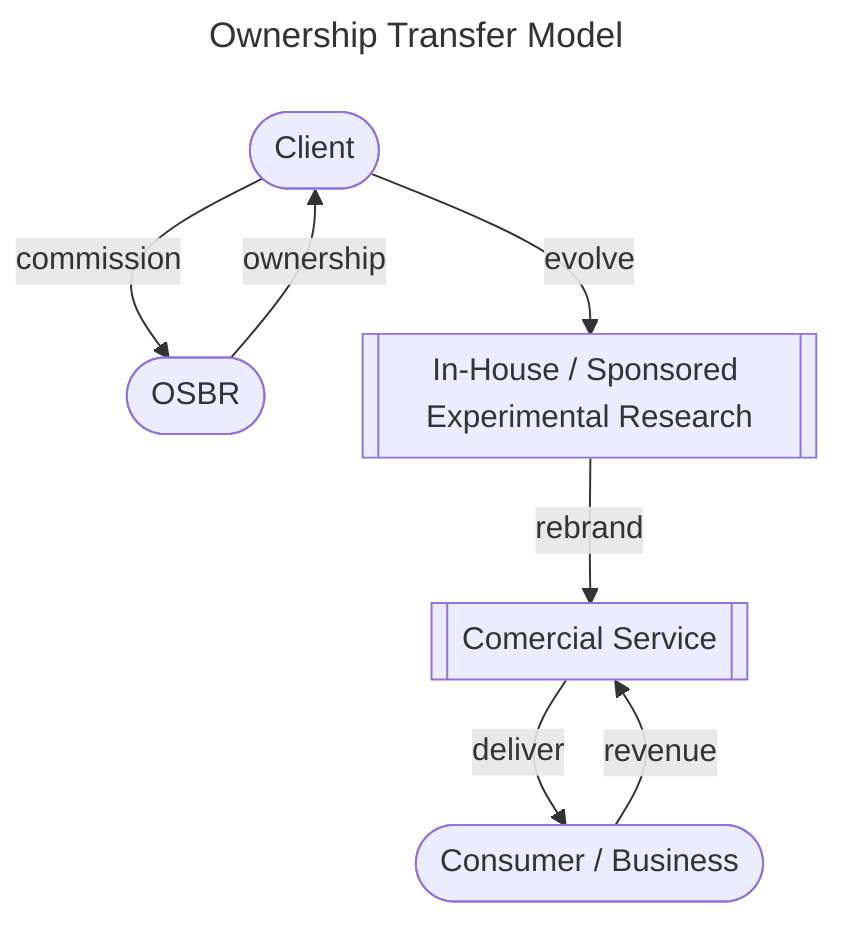

# Strategy

[[TOC]]

## 1. Vision

#### In a world where businesses make people happy, regardless of its size, thrive more and more.
 
The limits to what a person can do may be small and limited, but everyone’s smartphone has the power to communicate with the world. Gradually, it has made opportunities more equal. Small things may turn to bigger opportunities. We believe it’s not a matter of who provides it, but rather, a good product will spread quickly and widely regardless.

## 2. Value Delivery Model

We define our business domain through the Value Delivery Model, illustrated in the diagram below—a dynamic framework where we innovate and create value by seamlessly integrating the physical and digital realms.

```mermaid
---
title: Value Delivery Model
---
graph BT;
    subgraph OSBR
      direction BT
      SA[Solution Architecturing] -- "operation workforce" --> ED[Experience Development];
      SD[Software Development] -- "implementation workforce" --> ED;
      R[Research] -- "proposal materials" --> SA;
      R[Research] -- "technological insights" --> SD;
    end

    ED -- "proof of concept (PoC)" --> EFR[[Experimental Research]];

    subgraph Client / Partner
      direction BT
      ED -- "semi-custom solution" --> CDE[Digital Interface];
      CCV[Competitive Resource]
    end
    subgraph Collaborator
      CD[Communication Design / Marketing Research] --"exective support"--> CDE
    end
    CD --"exective support"--> EFR
    CCV -- "core value" --> CS[[Comercial Service]];
    CDE -- "liquidity enhancement" --> CS;
    EFR -- "field study" --> U[Consumer / Business];
    CS -- "enriched engagement" --> U;
````

Since our founder established "beatfast" (later renamed "Saturday Inc.") in 2013, we have been working on conceptual internet services designed to develop software artifacts and gain business domain insights. These assets enable us to deliver semi-custom solutions to our clients in Japan, not only providing OEM but also leveraging our knowledges to drive their businesses forward.

As OSBR, we expanded our visionary journey to "off-screen", as demonstrated by our projects [onray](https://www.weareonray.com/en) and [Time Crunch](https://www.wearetimecrunch.com/). These initiatives have provided invaluable feedback, inspiring us to envision even more innovative services while continuously refining our approach to deliver intuitive, impactful, and user-centered experiences that bridge the gap between the physical and digital worlds. 

Leveraging this foundation—and without altering our core vision—we have shifted our mid-term focus toward enhancing digital experiences through the application of large language models (LLMs). From the "Experimental to Commercial Application" strategy we established as beatfast to the expansion into the physical domain as OSBR, we continue to evolve. By introducing innovative services powered by LLMs, we aim to empower our client businesses and accelerate their growth.

## 3. Business Model

Our business model is designed to sustain our operations through the Value Delivery Model outlined above. It consists of four primary models, each tailored to distinct yet complemental roles that support one another."

### 3-1. In-House Experimental Research

This model focuses on internally conducted experimental research to develop proof-of-concept (PoC) projects. OSBR initiates the planning phase, guiding the creation of in-house experiments that deliver directly to consumers or businesses. The feedback gathered from these experiments is condensed and incorporated into semi-custom solutions, enabling iterative refinement and innovation while generating revenue.

```mermaid
---
title: In-House Experimental Research Model
---
graph TB;
    OSBR([OSBR]) -- "PoC planning" --> ES[[In-House Experimental Research]];
    CB -- "revenue" --> ES;
    ES -- "delivery" --> CB([Consumer / Business]);
    ES -- "feedback condensation" --> SPS[Semi-Custom Solution];
```

### 3-2. Sponsored Experimental Research

In this model, clients sponsor experimental research initiatives led by OSBR. The sponsored experiments are tailored to address client-specific needs and may evolve into semi-custom solutions, rebranded and refined by OSBR. These solutions are then delivered to the target audience, generating revenue while enabling clients to benefit from cutting-edge, tailored research and innovation.



### 3-3. Client Work

This model focuses on direct client commissions where OSBR takes ownership of the project while ensuring the client retains competitive resources. Semi-custom solutions are tailored, rebranded, and developed into commercial services, which are delivered to the client’s audience. This process generates revenue while enabling clients to benefit from OSBR's expertise and innovative solutions.




### 3-4. Ownership Transfer

The ownership transfer model allows OSBR to collaborate with clients, transferring ownership of PoC initiatives or semi-custom solutions developed through in-house or sponsored experimental research. These solutions are rebranded into commercial services and delivered to consumers or businesses. The client benefits from iterative evolution while OSBR ensures value delivery and sustainability through revenue generated by these solutions.



## 4. Operational Plan

### 4-1. Culture Cultivation

### 4-2. Talent Acquisition

### 4-3. Skill Development

### 4-4. Team Building

### 4-5. Product Roadmap

### 4-6. Risk Control

