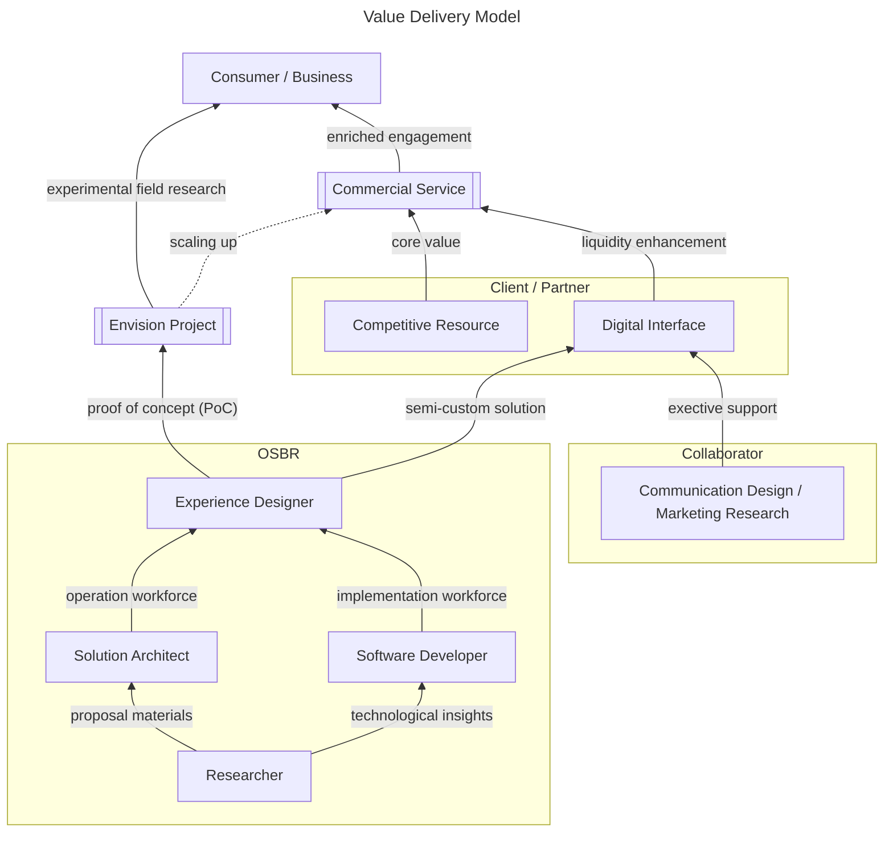
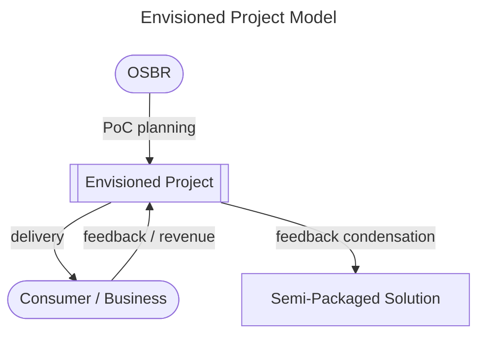
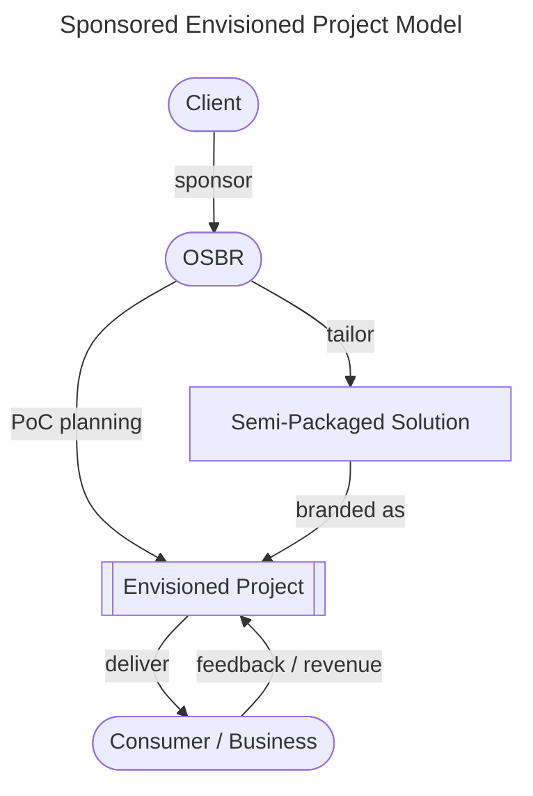
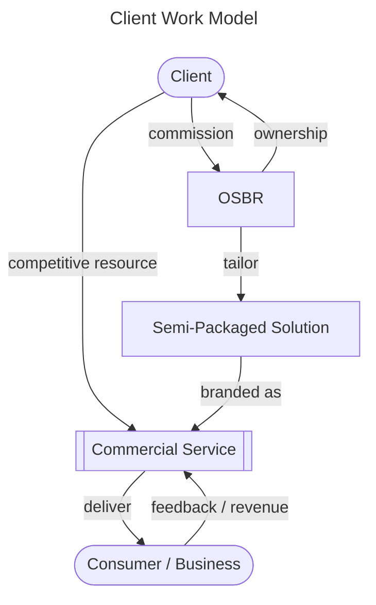
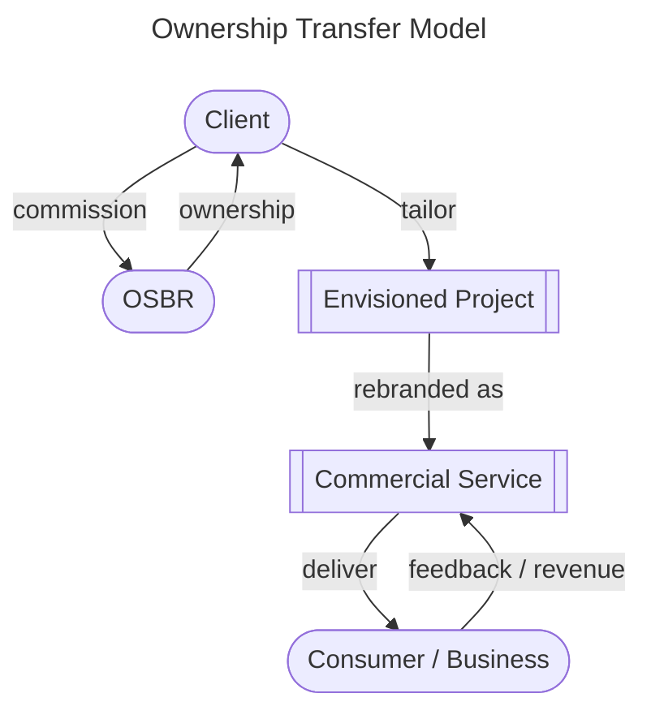

# Strategy Overview (Draft)

[[TOC]]

## 1. Vision

#### In a world where businesses make people happy, regardless of its size, thrive more and more.

The limits to what a person can do may be small and limited, but everyone’s smartphone has the power to communicate with the world. Gradually, it has made opportunities more equal. Small things may turn to bigger opportunities. We believe it’s not a matter of who provides it, but rather, a good product will spread quickly and widely regardless.

## 2. Value Delivery Model

We define our business domain through the Value Delivery Model, illustrated in the diagram below—a dynamic framework where we innovate and create value by seamlessly integrating the physical and digital realms.

Since our founder established "beatfast" (later renamed "Saturday Inc.") in 2013, we have been working on conceptual internet services designed to develop software artifacts and gain business domain insights. These assets enable us to deliver semi-custom solutions to our clients in Japan, not only providing OEM but also leveraging our knowledges to drive their businesses forward.

As OSBR, we expanded our visionary journey to "off-screen", as demonstrated by our projects [onray](https://www.weareonray.com/en) and [Time Crunch](https://www.wearetimecrunch.com/). These initiatives have provided invaluable feedback, inspiring us to envision even more innovative services while continuously refining our approach to deliver intuitive, impactful, and user-centered experiences that bridge the gap between the physical and digital worlds.

Leveraging this foundation—and without altering our core vision—we have shifted our mid-term focus toward enhancing digital experiences through the application of large language models (LLMs). From the experimental-to-commercial strategy we established as beatfast to the expansion into the physical domain as OSBR, we continue to evolve. By introducing innovative services powered by LLMs, we aim to empower our client businesses and accelerate their growth.

## 3. Business Model

Our business model is structured to align with the Value Delivery Model described above, ensuring sustainable operations while fostering innovation. The model comprises three key strategies, each designed to play a unique and complementary role in achieving our mission:

### 3-1. Envision Project

OSBR initiates and executes experimental research projects, referred to as "Envision Project". These projects are delivered directly to consumers or businesses, generating valuable feedback that refines our "Semi-Packaged Solution".

The "Semi-Packaged Solution" is a flexible framework composed of software artifacts and domain insights that can be tailored to meet the specific needs of a client. This model enables us to leverage our expertise to create innovative solutions while ensuring alignment with client objectives and retaining creative control over the project.

#### Sponsored Envision Project

In addition to our In-House Envision Project Model, we also offers a Sponsored Envision Project Model. OSBR undertakes experimental research projects tailored to the specific needs of clients. While OSBR retains ownership of the projects, clients are granted primary acquisition rights.

This approach is not solely focused on establishing profitability as a self-sustaining project but also aims to enhance non-monetary value, such as elevating brand image, increasing awareness, and fostering user engagement.

### 3-2. Client Work for Commercial Service

OSBR collaborates with clients to develop commercial services by leveraging its field knowledge and semi-packaged solutions. These services enable clients to maximize the value of their competitive resources while enhancing liquidity by reshaping value into forms that provide better experience and ease for users.

The services are designed to deliver refined, user-focused experiences, ensuring flexibility in scaling and monetization. Feedback from these services further contributes to OSBR’s innovation cycle, driving continuous improvement and alignment with market demands.

### 3-3. Ownership Transfer

In cases where clients wish to take full control of an Envisioned Project, OSBR facilitates ownership transfer, providing the necessary resources and support for a seamless transition. This model empowers clients to continue developing projects independently while benefiting from OSBR’s foundational contributions.

## 4. Operational Plan

### 4-1. Culture Cultivation

At OSBR, we are in the early stages of shaping our organizational culture. As a newly established company, we recognize the importance of building a strong foundation that reflects our values, vision, and workflows.

So by referring the [GitLab model](https://www.hbs.edu/faculty/Pages/item.aspx?num=57917), we have committed to developing the OSBR Handbook, a comprehensive guide publicly accessible as you can read this now. While our primary goal is to cultivate a strong internal culture, our open-access policy may also help refine OSBR’s identity by incorporating feedback from clients, partners, and potential collaborators.

This is not just a traditional approach but rather a pragmatic way to maintain context awareness in the emerging AI-Agent era while retaining control over both the accuracy and accessibility of organization-wide knowledge for humans. For the same reason, we write text not only for humans but also for AI at the project, repository, and pull request levels.

### 4-2. Talent Acquisition

Like many early-stage startups, we are facing challenges in attracting top talent. However, with the rise of LLMs, the way we define "skill" and "capability" is dynamically shifting. Even those who were once considered top professionals are now being pushed to adapt and transform.

At OSBR, we believe that talent is not just about past achievements, nor merely about adaptability or curiosity about new technologies. Rather, it is defined by the following abilities:

#### 4-2-1. An attitude transcending AI artifacts with AI

An ability to critically evaluate AI-generated artifacts without an attitude of unconditional acceptance or outright rejection—discerning whether they are accurate or flawed, beneficial or harmful.

In other words, it is a mindset that goes beyond AI artifacts by using AI—creating greater value rather than merely replicating it. To pursue an even greater ideal, one must sharpen a deeper intellectual appetite which AI-generated artifacts alone can never satisfy.

#### 4-2-2. A careful insight into semantic integrity

A linguistic skill to enrich the contextful vocabularies, avoiding ambiguous expressions from a word to a set of concepts, and from upstream to downstream. We priotize this skill because we believe software designing is to design a domain specific language (DSL) which enough descriptive for building the software. In this context, the meaning of "language" is expanded as following:

##### Discriptive Languages

| Visibility      | Name                 | Memo                                                   |
| --------------- | -------------------- | ------------------------------------------------------ |
| Character Based | Natural Language     | Descriptive in every abstraction level.                |
| Character Based | Programming Language | Executable as one formal expression with no ambiguity. |
| Graphical       | Graphic Image        | Envisional by picturing an aspect of the object.       |
| Graphical       | Movie                | More envisional with timeframe transformation.         |

These are languages that draw aspects of the same object from different viewpoints. The bottom line is not a matter of syntax, but semantics. Either syntax, with a careful insight into semantic integrity, we can describe the object more confidently, otherwise we, including AI, get lost in the mist.
