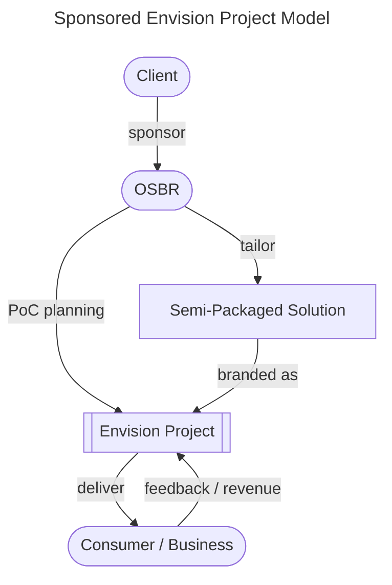
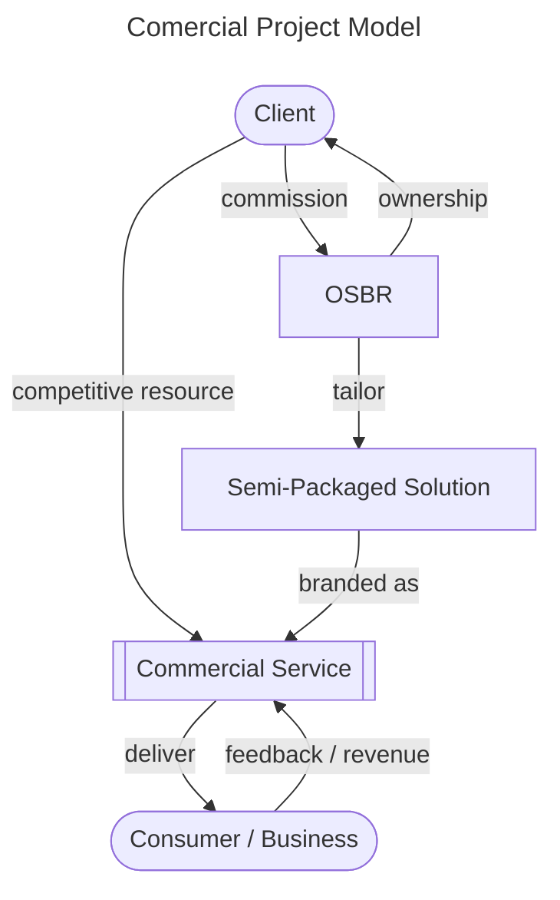
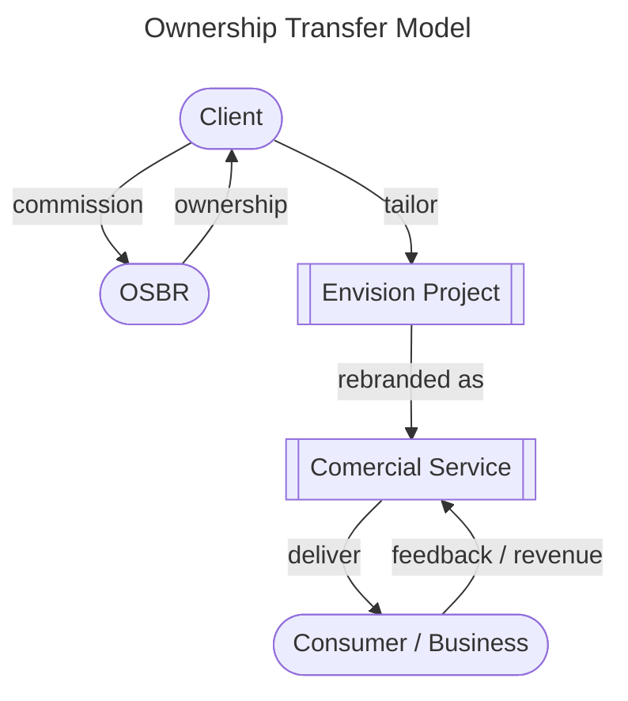

# Strategy Overview

[[TOC]]

## 1. Vision

#### In a world where businesses make people happy, regardless of its size, thrive more and more.
 
The limits to what a person can do may be small and limited, but everyone’s smartphone has the power to communicate with the world. Gradually, it has made opportunities more equal. Small things may turn to bigger opportunities. We believe it’s not a matter of who provides it, but rather, a good product will spread quickly and widely regardless.

## 2. Value Delivery Model

We define our business domain through the Value Delivery Model, illustrated in the diagram below—a dynamic framework where we innovate and create value by seamlessly integrating the physical and digital realms.

```mermaid
---
title: Value Delivery Model
---
graph BT;
    subgraph OSBR
      direction BT
      SA[Solution Architecturing] -- "operation workforce" --> ED[Experience Development];
      SD[Software Development] -- "implementation workforce" --> ED;
      R[Research] -- "proposal materials" --> SA;
      R[Research] -- "technological insights" --> SD;
    end

    ED -- "proof of concept (PoC)" --> EFR[[Envision Project]];

    subgraph Client / Partner
      direction BT
      ED -- "semi-custom solution" --> CDE[Digital Interface];
      CCV[Competitive Resource]
    end
    subgraph Collaborator
      CD[Communication Design / Marketing Research] --"exective support"--> CDE
    end
    CD --"exective support"--> EFR
    CCV -- "core value" --> CS[[Comercial Project]];
    CDE -- "liquidity enhancement" --> CS;
    EFR -- "experimental field research" --> U[Consumer / Business];
    CS -- "enriched engagement" --> U;
````

Since our founder established "beatfast" (later renamed "Saturday Inc.") in 2013, we have been working on conceptual internet services designed to develop software artifacts and gain business domain insights. These assets enable us to deliver semi-custom solutions to our clients in Japan, not only providing OEM but also leveraging our knowledges to drive their businesses forward.

As OSBR, we expanded our visionary journey to "off-screen", as demonstrated by our projects [onray](https://www.weareonray.com/en) and [Time Crunch](https://www.wearetimecrunch.com/). These initiatives have provided invaluable feedback, inspiring us to envision even more innovative services while continuously refining our approach to deliver intuitive, impactful, and user-centered experiences that bridge the gap between the physical and digital worlds. 

Leveraging this foundation—and without altering our core vision—we have shifted our mid-term focus toward enhancing digital experiences through the application of large language models (LLMs). From the experimental-to-commercial strategy we established as beatfast to the expansion into the physical domain as OSBR, we continue to evolve. By introducing innovative services powered by LLMs, we aim to empower our client businesses and accelerate their growth.

## 3. Business Model

Our business model is structured to align with the Value Delivery Model described above, ensuring sustainable operations while fostering innovation. The model comprises three key strategies, each designed to play a unique and complementary role in achieving our mission:

### 3-1. Envision Project

OSBR initiates and executes experimental research projects, referred to as "Envision Project". These projects are delivered directly to consumers or businesses, generating valuable feedback that refines our "Semi-Packaged Solution". 

The "Semi-Packaged Solution" is a flexible framework composed of software artifacts and domain insights that can be tailored to meet the specific needs of a client. This model enables us to leverage our expertise to create innovative solutions while ensuring alignment with client objectives and retaining creative control over the project.

```mermaid
---
title: Envision Project Model
---
graph TB;
    OSBR([OSBR]) -- "PoC planning" --> ES[[Envision Project]];
    CB -- "feedback / revenue" --> ES;
    ES -- "delivery" --> CB([Consumer / Business]);
    ES -- "feedback condensation" --> SPS[Semi-Packaged Solution];
```


#### Sponsored Envision Project

In addition to our In-House Envision Project Model, we also offers a Sponsored Envision Project Model. OSBR undertakes experimental research projects tailored to the specific needs of clients. While OSBR retains ownership of the projects, clients are granted primary acquisition rights. 

This approach is not solely focused on establishing profitability as a self-sustaining project but also aims to enhance non-monetary value, such as elevating brand image, increasing awareness, and fostering user engagement.



### 3-2. Comercial Project

OSBR collaborates with clients to develop commercial services by leveraging its field knowledge and semi-packaged solutions. These services enable clients to maximize the value of their competitive resources while enhancing liquidity by reshaping value into forms that provide better experience and ease for users.

The services are designed to deliver refined, user-focused experiences, ensuring flexibility in scaling and monetization. Feedback from these services further contributes to OSBR’s innovation cycle, driving continuous improvement and alignment with market demands.




### 3-3. Ownership Transfer

In cases where clients wish to take full control of an envision project, OSBR facilitates ownership transfer, providing the necessary resources and support for a seamless transition. This model empowers clients to continue developing projects independently while benefiting from OSBR’s foundational contributions.



## 4. Operational Plan

### 4-1. Culture Cultivation

### 4-2. Talent Acquisition

### 4-3. Skill Development

### 4-4. Team Building

### 4-5. Product Roadmap

### 4-6. Risk Control

