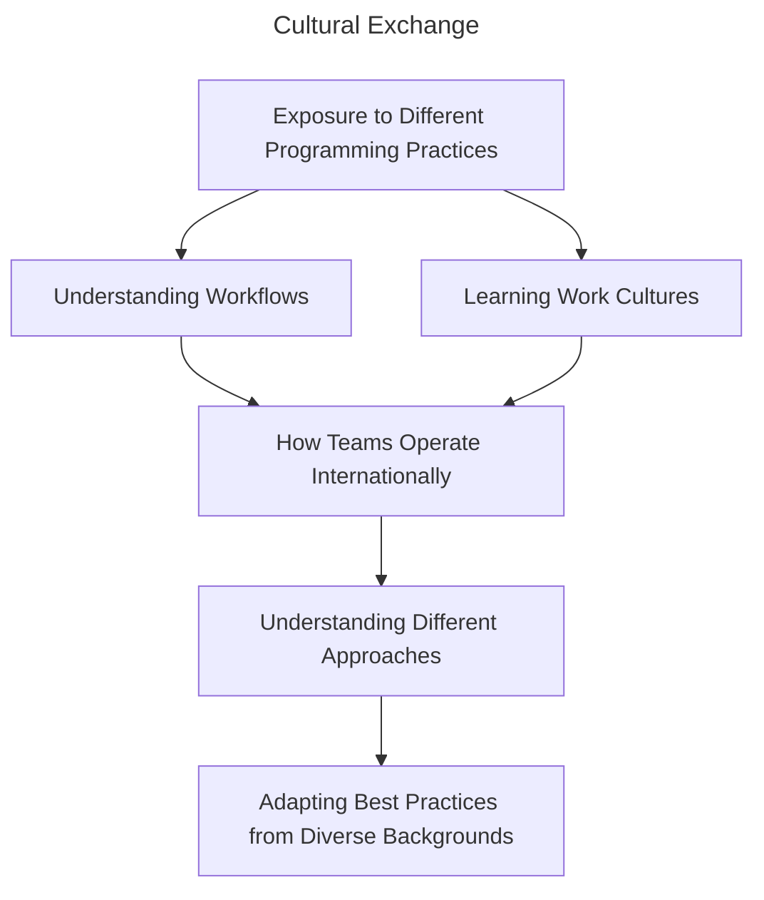
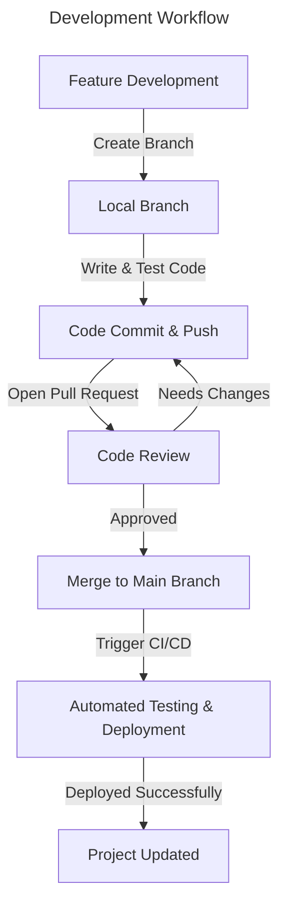
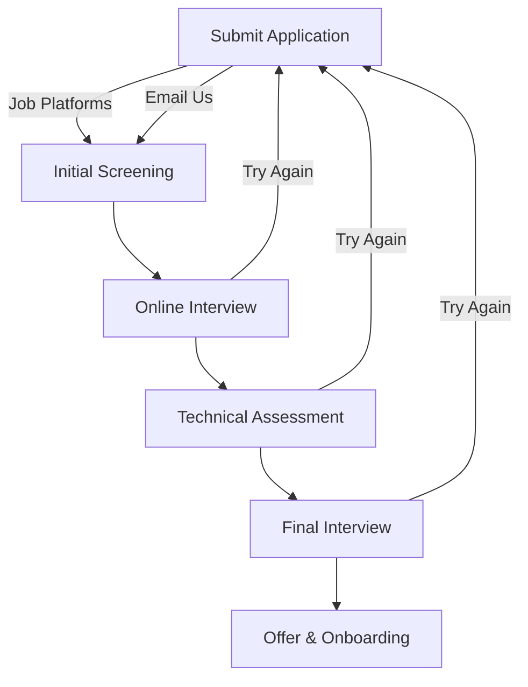

# Talent Acquisition

:::info Überprogrammer
The Übermensch, a concept from Nietzsche’s philosophy, represents an individual who transcends limitations. Just as the Übermensch rejects complacency, developers challenge outdated methodologies and shape the future of the digital landscape.
:::

[[TOC]]

## 1. OSBR and Programmers

Programmers thrive in dynamic, hands-on environments, and that’s exactly what we offer. As a startup deeply embedded in emerging technologies and real-world problem-solving, we provide a space where innovation and collaboration go hand in hand. Here, we don’t just follow industry trends but instead, we experiment with them. Whether it’s AI, cloud computing, or new development frameworks, we are aiming to explore technologies that shape the future.

Why should this interest you?

### 1-1. Hands-On Collaboration

Programmers shouldn't just be assigned to repetitive tasks or minor bug fixes. AI is already automating those tasks anways. The belief in learning by doing is something that should be hold on to.

Devs should be involved in building, testing, and iterating on real projects. Whether it’s prototyping new features, optimizing performance, or solving complex challenges. To actively contribute to meaningful work that has an impact is the point.

Initiative and problem-solving are most welcomed. That way, every developer gets to experience the full software development lifecycle, rather than just isolated fragments of it.

### 1-2. Exposure and Cultural Exchange

At OSBR, gaining exposure to different programming practices, workflows, and work cultures, particularly from Japan and Malaysia is a bonus treat.

This cultural exchange helps developers broaden perspectives in learning how teams operate internationally, understanding different approaches to software development, and adapting best practices from diverse backgrounds.

### 1-3. A Platform to Innovate and Grow

The hallmark of a programmer is creativity in problem-solving and technical curiosity. Developers should have freedom to experiment with new technologies, propose ideas, and take ownership of projects.

We believe in fostering an environment like that. For example, an environment where one can:

- Test new tools and frameworks.
- Contribute beyond code.
- Gain mentorship and feedback.

The goal is to create a space where programmers don’t just execute tasks, but actively shape the future of technology with their team.

## 2. The Mindset We Value in the AI Era

Like many early-stage startups, we are facing challenges in attracting top talent. However, with the rise of LLMs, the way we define skill as an effective capability is dynamically shifting. Even those who were once considered top professionals are now being pushed to adapt and transform.

While past achievements certainly deserve recognition, we believe the following factors are especially important at OSBR:

### 2-1. A Passion for Innovation Using AI

An ability to critically evaluate AI-generated artifacts, neither unconditionally accepting nor outright rejecting them, but discerning whether they are accurate or flawed, beneficial or harmful.

In other words, it is a mindset that seeks to go beyond AI artifacts by leveraging AI itself in creating greater value rather than merely replicating it. To pursue true innovation is to demand intellectual curiosity, creativity and perseverance, which AI-generated artifacts alone can never satisfy. Those who thrive in this field are not merely replicators of AI-generated output but active participants in shaping the future of technology.

### 2-2. A Careful Insight into Semantic Integrity

A linguistic skill to enrich contextual vocabularies while avoiding ambiguity, ranging from individual words to broader conceptual frameworks, and from upstream to downstream processes.

We prioritize this skill because we believe that software design is, in essence, the design of a domain-specific language (DSL) that is sufficiently descriptive for building software. In this context, the meaning of "language" expands as follows:

#### Descriptive Languages

| Format          | Name                 | Comment                                                                     |
| --------------- | -------------------- | --------------------------------------------------------------------------- |
| Character-Based | Natural Language     | Descriptive across all levels of abstraction.                               |
| Character-Based | Programming Language | Executable as a formal expression with no ambiguity.                        |
| Graphical       | Graphic Image        | Represents an aspect of an object visually.                                 |
| Graphical       | Movie                | Provides a more immersive representation through time-based transformation. |

These languages capture different aspects of an object from various perspectives. Ultimately, the key concern is not syntax but semantics. With a careful understanding of semantic integrity, we can describe objects with greater confidence. Otherwise, both humans and AI risk losing their way in ambiguity.

### 2-3. Emotional Intelligence Over Raw Intelligence

In a world increasingly shaped by AI, emotional intelligence (EQ) matters more than ever. While technical skills and intellect (IQ) are valuable, the ability to understand, empathize, and connect with others is what truly drives meaningful collaboration and leadership.

Empathy is not just an inherent trait but a skill that can be developed. Being kind, supportive, and strong at the same time is essential in any professional environment. Leadership, in particular, demands emotional resilience, not only in making sound decisions but also in maintaining a positive and composed demeanor. After all, a leader’s attitude sets the tone for the entire team.

### 2-4. A Directive Mindset for Decision-Making

A sense of directive thinking over binary thinking—in other words, a thoughtful mindset that seeks "better or worse" rather than simply concluding "right or wrong."

In the dark, we may walk straight with a light in our hand, illuminating the ground to ensure each step. However, we lose our way when we raise our heads, letting the light sweep from east to west instead of guiding our path. In reality, the best direction is often somewhere between right and left, and the same applies to every software decision.

Decision-making is not about finding the perfect answer but about choosing the best course of action in a given context. A directive mindset enables us to move forward despite uncertainty, refining our approach as we learn from experience.

### 2-5. A Strong Sense of Responsibility

Some argue that the last remaining job for humanity will be to take responsibility for AI’s failures. This may sound dystopian, yet it is a compelling notion as AI agents increasingly demonstrate their ability to take over intellectual tasks.

However, this is not necessarily a pessimistic outlook as long as we can assess and control AI’s outputs. Rather than competing with AI in producing ever-faster and more advanced results, it is more reasonable for humanity to focus on guiding and overseeing its development.

Ultimately, responsibility cannot be shifted onto AI itself. No matter how advanced AI becomes, it lacks true agency or accountability. This makes individual responsibility more important than ever, while ensuring that when problems arise, we have the ability to recognize, address, and resolve them effectively.

### 2-6. Communication, Teamwork and Collaboration

A brilliant idea alone is not enough. Its impact depends on how well it is communicated and implemented through teamwork. Strong communication skills help ensure clarity, reduce misunderstandings, and foster productive collaboration.

Teamwork is an essential part of every successful project. The ability to work harmoniously with colleagues, provide constructive feedback and adapt to different working styles leads to better solutions. At OSBR, we value individuals who actively contribute to a culture of open communication, respect and shared problem-solving.

## 3. Roles & Expectations

OSBR seeks builders, innovators, and problem-solvers. If you're interested in shaping the backbone of an application, designing seamless user experiences, or pushing the boundaries of AI, there's a place for you here.

There's a strong sense of collaboration over hierarchy here. If you're looking for a place where your ideas matter, you're in the right spot.

### 3-1. Roles

Here's a brief description of some roles that are available in our team. Which one describes you best?

#### Backend Developer

You're the architect. You enjoy designing efficient systems, and making things work behind the scenes.

| **What You’ll Do**                                          | **You’ll Thrive If You...**                                   |
| ----------------------------------------------------------- | ------------------------------------------------------------- |
| Design and maintain APIs that power our applications.       | Enjoy working with languages like Python, Go, or Node.js.     |
| Optimize databases for speed, reliability, and scalability. | Have experience with databases (SQL, NoSQL).                  |
| Work with cloud services to ensure smooth deployments.      | Are comfortable with cloud platforms like AWS, GCP, or Azure. |

---

#### Frontend Developer

You're the artist. You like turning ideas into beautiful and functional user interfaces. You care about design and making the web feel seamless.

| **What You’ll Do**                                                   | **You’ll Thrive If You...**                       |
| -------------------------------------------------------------------- | ------------------------------------------------- |
| Develop engaging, responsive user interfaces.                        | Love working with JavaScript, React, or Vue.js.   |
| Ensure a smooth, fast, and accessible experience for users.          | Have an eye for UI/UX and pixel-perfect design.   |
| Work with designers and backend developers to bring visions to life. | Enjoy crafting smooth animations and transitions. |

---

#### AI Engineer

You’re the innovator. Your fascination towards AI and its potential to revolutionize the way we work and live makes you eager to build.

| **What You’ll Do**                                       | **You’ll Thrive If You...**                                            |
| -------------------------------------------------------- | ---------------------------------------------------------------------- |
| Develop and fine-tune AI models.                         | Have experience with Python and frameworks like TensorFlow or PyTorch. |
| Work with large datasets to extract meaningful insights. | Enjoy working with data and optimizing machine learning models.        |
| Integrate AI into applications to enhance automation.    | Love experimenting with AI-powered solutions.                          |

### 3-2. Expectations

Although everyone carries a designated title, at OSBR, roles are not rigid boxes. We believe that programmers grow best when they have the freedom to explore different areas, collaborate across teams, and expand their skill sets. It's a culture where learning and adaptability are valued just as much as expertise.

Collaboration is at the heart of what we do. Projects are rarely built in isolation, and working closely with different teams is part of the process. We see titles as starting points rather than limitations. Growth isn’t just about writing better code, it’s about becoming a well-rounded and innovative problem solver. If you agree with these concepts towards being a programmer, you're exactly like us!

## 4. Technical Know-how

Technical skills are more than just knowledge of tools and frameworks. The value of an engineers lies on adaptability. Of course, there is also a need for a solid foundation in core principles.

### 4-1. Mastery of Core Technologies

A strong understanding of fundamental technologies is essential for building reliable systems.

| Field                    | Core Competencies                                         |
| ------------------------ | --------------------------------------------------------- |
| **Backend Development**  | API design, database management, server architecture      |
| **Frontend Development** | UI frameworks, state management, responsive design        |
| **AI & Data Processing** | Machine learning basics, data pipelines, model deployment |
| **Cloud Computing**      | Cloud services, containerization, serverless architecture |

Theres many softwares and programs that are able to handle these comptencies. It's your call to which one fits best for the task.

### 4-2. The Mindset of a Polyglot Engineer

I think the majority would agree when we say that a well-rounded engineer:

- Recognises the advantage of multiple languages (Python, JavaScript, Go, Rust, etc.)
- Cares about programming paradigms (object-oriented, functional)
- Adapts to new languages and frameworks based on project needs

Just like this handbook that's forever in-draft, A jack of all trades, master of none would carry more value than just A master of one. Wouldn't you agree?

### 4-3. Collaboration and Version Control

Software development is a team effort, and effective collaboration is critical anywhere, in any field. We, as a team, must be comfortable working within workflows, using version control systems like Git.

It's best to get to know collaborative tools and version control systems. After all, you're not alone in pushing changes to technology. You're standing on the backs of those before you and together, the impossible begins to look a little more possible.

## 5. Application Process

Our hiring process is transparent and straightforward, so you know what to expect.

### 5-1. What to Expect

#### Application Submission

- Applying via job platforms like Jobstreet or Hiredly. Besides that, you can email us directly.

#### Initial Screening

- A quick introduction to understand your experience and interests. You'd be reached via a phone call.

#### Online Interview

- Discuss your background, projects, and problem-solving approach. A couple of personality questions too.

#### Technical Assessment

- A take-home challenge or live coding session. We'll let you know beforehand and agree on a speicifc time together so you don't have to worry about timing or availability.

#### Final Interview

- Meet the team and we'll find out how you fit within OSBR.

#### Offer & Onboarding

- You're a perfect match, welcome aboard!
